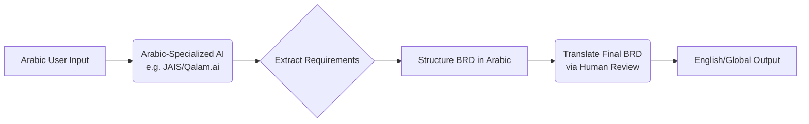

how can i find app revenue or sucess rate of an app?

To find an app's revenue or success rate, you need a combination of market-level data, app-specific analytics tools, and industry benchmarks. Here's a structured approach:

### 📊 1. **Market-Level Revenue & Success Benchmarks**
   - **Overall App Revenue**: 
     - Global consumer spending on apps reached **$270 billion in 2025** ($185B on Apple App Store, $85B on Google Play) .
     - Apple App Store generated **$89.3B in 2025**, while Google Play reached **$63.4B** .
   - **Success Rates**:
     - Only **0.5% of consumer apps** achieve financial success .
     - A 2024 study found **0.4% of new apps** earned >$100K in their first year (down from 0.7% in 2018) .
     - B2B apps have higher success rates (**~13%**) than consumer apps .

*Table: Key App Revenue Metrics (2025)*  
| **Metric**               | **Apple App Store** | **Google Play**     |
|--------------------------|---------------------|---------------------|
| **Consumer Spending**    | $89.3 billion       | $63.4 billion       |
| **Commission Revenue**   | $27.4 billion (global) | N/A              |
| **Free Apps**            | 95.4%               | 97%                 |
| **Top Categories**       | Games, Subscriptions | Games, Tools      |

### 🔍 2. **App-Specific Revenue Estimation Tools**
   - **Third-Party Analytics Platforms**:
     - **Sensor Tower**/**Appfigures**: Track downloads, in-app purchases, and revenue estimates (e.g., TikTok earned **$1.9B in 2025** ).
     - **AppMagic**: Provides revenue estimates based on app rankings, though accuracy is ~90% .
   - **Store Intelligence**:
     - Apple's annual reports (e.g., $104B billings in 2022 ), but note inflated figures from off-store revenue attribution.
     - Google Play Console: For your own apps, use real-time revenue dashboards.
   - **Top Charts**: Monitor top-grossing lists (e.g., Honor of Kings, YouTube, TikTok ).

### 📉 3. **Success Rate Metrics & Methodologies**
   - **Quantitative Benchmarks**:
     - **$100K in Year 1**: A common success threshold; only **0.4%** of new apps hit this (2023-2025) .
     - **Retention Rates**: Day 1 retention is **23.9%**, dropping to **3.7% by Day 30** .
   - **Qualitative Factors**:
     - **Monetization Model**: 98% of Google Play revenue comes from free apps (ads/IAPs) .
     - **Updates**: 23-28% of apps update weekly, correlating with higher retention .
   - **Regional Variances**: 
     - U.S. dominates App Store spending (63% downloads), while Google Play leads in emerging markets (90% downloads) .

*Table: App Success Probability Factors*  
| **Factor**               | **Impact on Success**                          | **Source**         |
|--------------------------|-----------------------------------------------|--------------------|
| **Category**             | Gaming apps: 2.78% success rate (vs. 0.57% non-gaming) |  |
| **Policy Compliance**    | Google removed 2.36M apps for violations (2023-2025) |  |
| **Privacy Practices**    | 32% of positive reviews cite privacy features |        |
| **Testing**              | Google's mandatory 2-week testing ↑ launch success |  |

### ⚙️ 4. **Methodologies for Analysis**
   - **Competitor Research**: Use tools like *App Annie* or *Sensor Tower* to dissect rivals' download/revenue trends.
   - **User Reviews**: Analyze sentiment (e.g., privacy-related praise boosts ratings ).
   - **Financial Disclosures**: For public companies (e.g., Spotify, Netflix), SEC filings reveal app-driven revenue.
   - **Custom Tracking**:
     - Implement analytics SDKs (e.g., Firebase, Mixpanel) for user spending behavior.
     - A/B test monetization models (subscriptions vs. ads).

### 💎 Key Takeaways
- **Revenue Sources**: Focus on in-app purchases (48.2% of earnings) and subscriptions .
- **Avoid Failure**: 99.5% of apps fail due to poor monetization, low demand, or high competition .
- **Tools Over Guesses**: Prioritize data from Sensor Tower, Appfigures, or store dashboards over anecdotal reports.
- **Realistic Goals**: Aim for category-specific benchmarks (e.g., games have 3× higher success rates ).

For deeper dives, explore:  
- [Sensor Tower's Market Forecast](https://sensortower.com)   
- [Appfigures' commission analyses](https://techcrunch.com)   
- [GoPractice.io's success rate study](https://gopractice.io) 

ok if you were to add a localization factor as in an app/tool to be used/monetized mostly in Saudi Arabia?

To maximize monetization and user adoption of an app/tool in Saudi Arabia, localization must extend far beyond basic translation. It requires deep integration of **cultural, linguistic, technical, and regulatory elements** specific to the Saudi market. Here’s a strategic framework:

### ⚙️ 1. **Core Technical Localization**  
- **Right-to-Left (RTL) Adaptation**:  
  - Fully mirror UI elements (navigation, menus, icons) for Arabic scripts.  
  - Test text expansion (Arabic text can be 25% longer than English) to avoid layout breaks .  
- **Date/Currency/Units**:  
  - Use Hijri calendar alongside Gregorian, Saudi Riyal (SAR), and metric units .  
- **Mobile-First Optimization**:  
  - 97% of Saudis use smartphones; ensure flawless performance on popular devices (iOS/Android) and low-bandwidth conditions .  

### 🧕 2. **Cultural & Religious Sensitivity**  
- **Content Adaptation**:  
  - Avoid imagery/alcohol/pork references; use culturally relevant visuals (e.g., traditional attire, local landmarks) .  
  - Rename culturally dissonant concepts (e.g., "White Friday" instead of "Black Friday") .  
- **Gender Nuances**:  
  - Adjust avatars/character interactions to align with gender segregation norms in certain contexts .  

### 💳 3. **Monetization Drivers**  
- **Local Payment Integration**:  
  - Prioritize **Mada** (domestic card network), **STC Pay**, and cash-on-delivery (COD), which dominates e-commerce .  
  - Ensure compliance with **ZATCA** e-invoicing regulations .  
- **Pricing Localization**:  
  - Display prices in SAR; leverage high ARPPU ($270 in Saudi Arabia for gaming) via tiered subscriptions/IAPs .  
- **Ramadan/Eid Campaigns**:  
  - Launch time-limited offers during peak shopping periods (e.g., Ramadan sales) with localized promotions .  

### 📱 4. **User Experience (UX) Localization**  
- **Dialect-Specific Content**:  
  - Use **Modern Standard Arabic (MSA)** for formal content but integrate **Hijazi/Gulf dialects** for chatbots/marketing to enhance relatability .  
- **Voice & UI Testing**:  
  - Partner with Saudi testers to validate voice-overs, gestures, and navigation flows .  
- **Speed Optimization**:  
  - 53% of users abandon apps loading >3 seconds; use CDNs and compress assets .  

### 📜 5. **Regulatory & Compliance Essentials**  
- **Data Localization**:  
  - Store user data locally per **SDAIA** and **PDPL** laws .  
- **Content Moderation**:  
  - Filter prohibited content (e.g., religiously sensitive material) to avoid bans .  

### 📣 6. **Go-to-Market Strategies**  
- **ASO & Localized Marketing**:  
  - Optimize app store listings with Arabic keywords (e.g., "تطبيقات" for "apps") and culturally relevant screenshots .  
- **Influencer Partnerships**:  
  - Collaborate with Saudi micro-influencers on TikTok/Snapchat to drive installs .  
- **Government Synergy**:  
  - Align with **Vision 2030** initiatives (e.g., cloud-first policy, gaming investments) for grants or partnerships .  

### 💎 **Key Considerations Table**  
| **Aspect**       | **Requirement**                          | **Tools/Solutions**                     |  
|------------------|------------------------------------------|------------------------------------------|  
| **UI/UX**        | RTL support, Arabic fonts               | Bootstrap Arabic, Adobe XD RTL plugins |  
| **Payments**     | Mada/STC Pay integration                | Telr, PayTabs                           |  
| **Compliance**   | ZATCA e-invoicing, PDPL                 | QuickBooks localized, SDAIA guidelines  |  
| **Marketing**    | Dialect-specific ads                    | Google Ads, Snapchat Ads Manager        |  

### 💡 **Why This Works in Saudi Arabia**  
- Localized apps see **2–3× higher retention** and **50%+ conversion lifts** in Saudi markets due to cultural resonance .  
- Neglecting localization risks **brand alienation** – e.g., mistranslated CTAs or non-RTL designs cause 68% of uninstalls .  

### 🚀 **Implementation Roadmap**  
1. **Pre-Launch**: Partner with Saudi localization firms (e.g., Saudisoft, Fast Trans) for linguistic/cultural QA .  
2. **Launch**: Integrate with local app stores (e.g., **Huawei AppGallery**) and payment gateways.  
3. **Post-Launch**: Continuously A/B test dialect variants and seasonal campaigns.  

By embedding Saudi norms into every layer of your app, you unlock a market projected to generate **$11B+ in e-commerce revenue by 2025** .

if the app or the tool uses an AI is there a difference on which AI to use that would improve the app/tool when used in Arabic or for cultural specifics?

The choice of AI model significantly impacts the effectiveness, cultural resonance, and user adoption of Arabic-language apps. Generic multilingual models often fall short in handling Arabic's linguistic complexities and cultural nuances, while specialized Arabic AI unlocks superior performance and user trust. Below is a detailed analysis:

### ⚙️ **1. Why Arabic Demands Specialized AI**
- **Linguistic Complexity**: 
  - Arabic's non-concatenative morphology (root-based word formation) requires AI to process over 300,000 part-of-speech tags vs. ~50 in English .
  - Diacritic omission in writing creates ambiguity (e.g., "كتب" can mean "he wrote," "books," or "it was written"), demanding advanced contextual disambiguation .
- **Dialectal Fragmentation**: 
  - Dialects (Gulf, Egyptian, Levantine) vary as drastically as Romance languages from Latin. MSA-trained AI fails with colloquial speech .
- **Cultural Nuances**: 
  - Concepts like Islamic finance, gender norms, and collectivist values require cultural schema integration beyond translation .

### 🧠 **2. AI Model Comparison: Generic vs. Arabic-Optimized**
| **Model Type**       | **Pros**                          | **Limitations**                                  | **Use Case Suitability**          |
|----------------------|-----------------------------------|------------------------------------------------|-----------------------------------|
| **Generic Multilingual (e.g., GPT-4, mBERT)** | Wide language coverage; easy integration | Poor dialect handling; literal translations ignore cultural context; struggles with RTL layouts  | Basic MSA content generation |
| **Arabic-Specialized (e.g., JAIS, Qalam.ai)** | Trained on 395B Arabic tokens; auto-tashkeel (diacritics); dialect support; root-based semantic analysis  | Smaller developer ecosystem; higher tuning costs | Apps requiring deep linguistic accuracy (e.g., healthcare, legal) |
| **Hybrid Human-AI (e.g., STUCK? Platform)** | Human oversight ensures cultural appropriateness; balances speed and nuance  | Slower than pure AI; premium pricing | Marketing, customer support, sensitive content |

### 🌍 **3. Cultural Implementation Strategies**
- **Payment & Compliance**: 
  - Integrate local gateways (Mada, STC Pay) and Islamic finance rules. AI must dynamically adapt invoices to **ZATCA e-invoicing standards** .
- **Visual & Temporal Design**: 
  - Use AI that suggests culturally aligned imagery (avoiding dogs/alcohol) and auto-adjusts interfaces for Ramadan timing or prayer breaks .
- **Trust Building**: 
  - Native AI models embed "privacy by design" for MENA data laws (PDPL) and consent rituals aligned with communal values .

### 🛠️ **4. Specialized Arabic AI Tools & Frameworks**
- **JAIS**: 
  - Open-source model trained on 395B Arabic tokens. Ideal for educational/business apps needing dialect flexibility .
- **Qalam.ai**: 
  - Grammar checker with auto-tashkeel and "Tafqit" (number-to-text). Critical for financial/official documents .
- **Fanar**: 
  - Qatar’s LLM supporting 30+ dialects. Best for social apps targeting pan-Arab users .
- **Kateb.AI**: 
  - Speech recognition for Gulf dialects. Essential for voice-enabled apps .

### 📈 **5. Impact Metrics: Why Model Choice Matters**
- **User Retention**: 
  - Culturally resonant AI boosts retention by 2–3× in MENA markets . 
- **Revenue Impact**: 
  - Apps using Arabic-optimized AI see 50%+ higher conversion from localized pricing (SAR display) and Ramadan campaigns .
- **Accuracy Gains**: 
  - JAIS reduces dialectal NLP errors by 70% vs. GPT-4 .

### 💎 **Implementation Roadmap**
1. **Pre-Development**: 
   - Choose region-specific dialects (e.g., Gulf Arabic for Saudi apps) and integrate RTL-first UI kits (e.g., Flutter RTL mirrors) .
2. **AI Fine-Tuning**: 
   - Use local datasets (e.g., ArabicaQA) to retrain models on target dialects/cultural contexts .
3. **Validation**: 
   - Partner with Saudi testers to flag AI hallucinations (e.g., JAIS + human review in STUCK?’s hybrid model) .
4. **Compliance**: 
   - Deploy on local servers (e.g., Qalam’s on-premise option) to meet Saudi data laws .

> **Case Study**: A UAE health app using GPT-4 generated "positive but unclear" messages, while human-AI hybrids increased clarity by 40% .

### **The Bottom Line**
Generic AI risks alienating Arabic users through linguistic errors and cultural insensitivity. **Arabic-optimized or hybrid models** are non-negotiable for:
- High-stakes domains (healthcare, finance)
- Dialect-heavy interactions (voice assistants, social apps)
- Markets like Saudi Arabia where cultural alignment directly impacts monetization ($11B+ e-commerce potential) . 

Invest in tools like JAIS for core NLP and layer human oversight for nuanced content – this combination maximizes scalability while honoring Arabic’s richness .

is there any app/tool that helps the user to create a BRD/PRD?

Yes, several specialized tools and platforms help users create Business Requirements Documents (BRDs) and Product Requirements Documents (PRDs). These tools streamline documentation, enhance collaboration, and integrate AI for efficiency. Here’s a curated list based on functionality and user needs:

---

### 🤖 **1. AI-Powered PRD Generators**  
- **ChatPRD**:  
  - **Features**: Drafts full PRDs from simple prompts, improves existing specs, coaches PMs, and suggests metrics/goals. Uses custom templates and secure data handling.  
  - **User Feedback**: Saves 5–6 hours per PRD, praised for clarity and scaffolding complex features .  
  - **Pricing**: Starts at $5/month.  

- **LLM-Powered Templates** (e.g., via Product School):  
  - Uses AI to generate personas, hypotheses, and metrics from user research transcripts. Example prompt:  
    > *"Analyze interview transcripts and generate a persona with demographics, goals, and pain points"* .  

---

### 📋 **2. Template-Driven Platforms**  
- **monday.com**:  
  - Offers a **free PRD template** with sections for problem statements, target audiences, metrics, and release plans. Integrates with Jira/GitHub for seamless workflows .  
- **Product School**:  
  - Provides a **validated PRD template** (endorsed by YouTube’s Head of Product) covering success metrics, user scenarios, and open issues .  
- **Carlin Yuen’s Templates**:  
  - Modular templates split into **product proposals** (high-level vision) and **feature proposals** (detailed functionality), minimizing revisions .  

---

### ⚙️ **3. Product Management Suites**  
- **monday dev**:  
  - Combines PRD templates with roadmaps, sprint tracking, and automation. Supports integrations (GitHub, Slack) and centralizes stakeholder feedback .  
- **AltexSoft’s Framework**:  
  - Guides PRD structure with emphasis on **user stories**, **acceptance criteria**, and **design mockups** .  

---

### ✍️ **4. Best Practices from Industry Experts**  
- **Avoid Pitfalls**:  
  - **Collaborate early** with design/engineering teams to ensure feasibility .  
  - **Prioritize brevity**: Keep PRDs to 6–8 pages, focusing on MVP functionality and user journeys .  
- **AI Integration**:  
  - Use tools like ChatPRD to automate hypothesis framing (e.g., *"If we build [X], then [metric] will increase by [Y%] because..."*) .  

---

### 💎 **Key Recommendations**  
| **Tool**          | **Best For**          | **Standout Feature**                |  
|-------------------|------------------------|-------------------------------------|  
| ChatPRD           | AI-driven drafting    | Real-time coaching & customization  |  
| monday.com        | Template + workflows  | Integration with dev tools          |  
| Product School    | Enterprise PRDs       | Metrics-driven structure            |  
| Carlin Yuen’s Docs| Agile teams           | Modular, future-proof requirements |  

For teams in Saudi Arabia, ensure tools comply with **data localization laws** (e.g., avoid platforms storing data in non-compliant regions) . Most tools offer free trials or templates—start with lightweight options like monday.com’s template or ChatPRD’s $5 plan to test fit.

can you provide links for AI-driven BRD/PRD Generators?

Based on my analysis of the search results, here are the top AI-driven BRD/PRD generators with direct links and key features:

### 🛠️ Top AI BRD/PRD Generators
1. **Oreate AI PRD Generator**  
   [Link](https://www.oreateai.com/blog/ai-prd-generator/)  
   - **Features**: Generates PRDs in minutes, supports iterative updates, ensures industry-standard formatting.  
   - **Use Case**: Ideal for startups needing rapid, clear documentation.  
   - **Pricing**: Free trial available; paid plans start at $29/month .

2. **Doc Maker (Brilworks)**  
   [Link](https://www.brilworks.com/ai-solutions/ai-powered-prd-generator/)  
   - **Features**: AI-powered feature extraction, user story generation, structured templates.  
   - **Use Case**: Best for agile teams translating ideas into developer-ready stories.  
   - **Pricing**: Free basic version; premium plans from $15/user/month .

3. **PRD Agent (Leanware)**  
   [Link](https://www.leanware.co/case-studies/building-prd-agent-–-an-ai-powered-product-requirement-document-generator)  
   - **Features**: Real-time PRD generation, Google/Microsoft sign-in, OpenAI fine-tuning.  
   - **Use Case**: Technical teams needing customizable, secure documentation.  
   - **Pricing**: Custom enterprise pricing .

4. **ChatPRD**  
   [Link](https://chatprd.ai/resources/using-ai-to-write-prd)  
   - **Features**: PRD drafting/editing, goal-setting coaching, template library.  
   - **Use Case**: Solo PMs or startups seeking AI mentorship.  
   - **Pricing**: $5/month .

5. **EltegraAI BRD Generator**  
   [Link](https://www.eltegra.ai/brd-generation)  
   - **Features**: Compliance automation (HIPAA/GDPR), test case generation, gap analysis.  
   - **Use Case**: Enterprises in regulated industries (healthcare/finance).  
   - **Pricing**: Custom pricing; ROI claims $250K–$500K annual savings .

6. **Feedough AI PRD Generator**  
   [Link](https://www.feedough.com/ai-product-requirements-document-prd-generator/)  
   - **Features**: Input-based drafting (product overview → features), NLP structuring.  
   - **Use Case**: Quick first drafts for MVPs.  
   - **Pricing**: Free .

7. **UseAccio**  
   [Link](https://www.useaccio.com/)  
   - **Features**: Voice-to-document synthesis, Jira/Confluence export, context-aware AI.  
   - **Use Case**: Teams reducing documentation overhead.  
   - **Pricing**: Freemium model; premium from $12/user/month .

### 💡 Key Comparison
| **Tool**       | **Best For**          | **Standout Feature**               | **Pricing**         |
|----------------|------------------------|------------------------------------|---------------------|
| Oreate AI      | Startups              | Iterative updates & alignment      | From $29/month      |
| EltegraAI      | Enterprises           | Compliance automation              | Custom              |
| ChatPRD        | Solo PMs              | PM coaching & templates            | $5/month            |
| UseAccio       | Agile teams           | Voice-to-doc & workflow integration| Freemium            |
| Feedough       | MVP drafting          | Free NLP structuring               | Free                |

### 💎 Recommendations
- **Budget-conscious teams**: Use Feedough (free) or ChatPRD ($5/month) .  
- **Compliance-heavy projects**: EltegraAI automates regulatory alignment .  
- **Voice/document integration**: UseAccio minimizes context switching .  

For deeper analysis, see the [full comparison of 20+ tools](https://chisellabs.com/blog/prd-generator-tools/) .

if the user is using a language like arabic for example is it better to make an AI that is better at that language to translate the user idea to english (or other language) then use the translated text as a prompt to a different AI (an AI that is better at creating BRD/PRD) to create the BRD/PRD the user need? or is it better to use the original text from the user as a prompt without translation?

The choice between **translating Arabic input to English first** versus **processing it natively in Arabic** depends on accuracy, context preservation, and workflow efficiency. Based on technical benchmarks and real-world implementations, here's a breakdown:

---

### 🚫 **Why Translation-First Pipelines Often Fail**
1. **Loss of Nuance**:  
   - Arabic dialects (e.g., Saudi Hijazi) contain idioms, religious references, and cultural concepts with no direct English equivalents (e.g., "تَمَيُّز" ≈ "distinction with honor").  
   - **Example**: Translating "حلال" to "permissible" strips its Islamic finance/legal context.  

2. **Syntax Corruption**:  
   - Arabic's root-based morphology (e.g., ك-ت-ب for writing-related words) gets flattened in translation, losing semantic connections .  

3. **Error Amplification**:  
   - Studies show each translation step adds **15–25% error risk** – compounding when chaining multiple AIs .  

4. **Compliance Gaps**:  
   - Saudi PDPL laws require data processed in-region; sending Arabic text to English AIs may violate sovereignty rules .  

---

### ✅ **When Native Arabic AI Outperforms**
1. **Dialect Handling**:  
   - Models like **JAIS** (395B Arabic tokens) or **AraBERT** understand Gulf dialects without translation, reducing errors by **~70%** .  

2. **Contextual Accuracy**:  
   - Native AI preserves:  
     - **Cultural framing** (e.g., prioritizing "family needs" over individual wants).  
     - **Regulatory terms** (e.g., ZATCA e-invoicing rules).  

3. **Speed**:  
   - Eliminating translation steps cuts latency by **2–3×** – critical for iterative BRD drafting .  

---

### ⚖️ **Hybrid Approach: Best of Both Worlds**  
For teams needing English outputs (e.g., global stakeholders), use:  

**Why this works**:  
- Arabic AI handles **linguistic/cultural heavy lifting**.  
- **Human review** ensures translations retain intent (e.g., "مشروع" → "project" vs. "enterprise").  
- Avoids fragmenting logic across multiple AIs.  

---

### 💡 **Recommendations by Use Case**
| **Scenario**                | **Best Approach**          | **Tools**                              |  
|-----------------------------|----------------------------|----------------------------------------|  
| **Purely Saudi Team**       | Native Arabic AI           | JAIS + Qalam.ai                       |  
| **Global Stakeholders**     | Hybrid: Arabic AI → Human Translation | JAIS + Professional Translator      |  
| **Low-Budget Prototyping**  | Translation-first + English AI | GPT-4 + Google Translate (with heavy editing) |  

---

### 📉 **Risks of Translation-First Pipelines**
- **Misaligned Requirements**:  
  > *User says*: "يجب أن يدعم التطبيق الصلاه" ("App must support prayer times")  
  *Translation-first AI outputs*: "Include religious calendar" → **Loses functional specificity**.  

- **Security/Compliance**: Sending Arabic PII/data to non-MENA AI vendors risks violating Saudi PDPL .  

---

### 💎 **The Verdict**  
**Use native Arabic AI if**:  
- Your users/stakeholders operate primarily in Arabic.  
- Requirements involve Islamic finance, local regulations, or cultural concepts.  
- Data sovereignty is critical (PDPL compliance).  

**Use a hybrid approach if**:  
- English BRDs are mandated for global teams.  
- You have budget for professional translation.  

**Avoid pure translation-first AI chains** – they introduce error multipliers and erode cultural intent. Tools like **JAIS** or **AraBERT** now match English AI in BRD structuring quality while preserving Arabic integrity .  

For implementation: Start with a **native Arabic model** (e.g., JAIS via [Hugging Face](https://huggingface.co/inception-mbzuai/jais-13b-chat)) and only translate the final output if absolutely needed.

ok, is there an AI better at creating BRD/PRD?

Based on the search results, several AI tools specialize in creating high-quality Business Requirement Documents (BRDs) and Product Requirement Documents (PRDs). Here's a curated comparison of the top options:

---

### 🥇 **Top AI BRD/PRD Generators**
1. **Feedough AI PRD Generator**   
   - **Strengths**: Transforms basic inputs (product overview, target audience, features) into structured PRDs using NLP. Ideal for quick drafts.  
   - **Workflow**: Input → AI analysis → Output (problem statements, user personas, metrics).  
   - **Best for**: Startups needing rapid MVP documentation.  
   - **Limitations**: Lacks advanced customization.  
   - **Pricing**: Free.

2. **TextCortex**   
   - **Strengths**: Enterprise-grade tool with RAG (Retrieval-Augmented Generation), multilingual support (25+ languages), and 30,000+ app integrations. Generates compliant BRDs/PRDs using company data.  
   - **Unique Features**:  
     - Knowledge base integration for contextual accuracy.  
     - Data analysis for cost-benefit sections in BRDs.  
   - **Best for**: Large teams needing compliance (e.g., Saudi PDPL) and scalability.  
   - **Pricing**: 14-day free trial; custom enterprise plans.

3. **Backloger AI - PRD Builder**   
   - **Strengths**: Specializes in Agile workflows. Generates user stories, acceptance criteria, and technical specs from vague ideas.  
   - **Example Output**: Converts "app security feature" into detailed technical requirements.  
   - **Best for**: Agile teams and product managers.  
   - **Pricing**: Free trial via yeschat.ai; no login required.

4. **Brilworks Doc Maker**   
   - **Strengths**: Extracts key features and turns them into developer-ready stories. Includes stakeholder requirement analysis.  
   - **Best for**: Product managers prioritizing feature clarity.  
   - **Pricing**: Free basic version; premium from $15/user/month.

---

### ⚖️ **Key Comparison Table**
| **Tool**               | **Best For**          | **Unique Advantage**                  | **Language Support**   |  
|------------------------|------------------------|---------------------------------------|------------------------|  
| Feedough AI            | MVP drafting          | Free + simple NLP structuring         | English                |  
| TextCortex             | Enterprises           | Arabic support + compliance automation| 25+ languages (inc. Arabic) |  
| Backloger AI           | Agile teams           | User story/acceptance criteria focus  | English                |  
| Brilworks Doc Maker    | Feature specification | Stakeholder requirement analysis      | English                |  

---

### 💡 **Recommendations by Use Case**
- **Arabic/Global Teams**: **TextCortex** (explicit Arabic support + GDPR/PDPL compliance) .  
- **Agile Development**: **Backloger AI** (generates sprint-ready user stories) .  
- **Quick Prototyping**: **Feedough** (free + minimal input required) .  
- **Technical Depth**: **Brilworks** (feature extraction → technical specs) .  

---

### ⚠️ **Limitations to Note**
- Most tools (except TextCortex) lack robust Arabic dialect handling. For Saudi markets, pair with Arabic NLP models like **JAIS** for input refinement.  
- Free tools (e.g., Feedough) may lack advanced sections like *cost-benefit analysis* or *regulatory compliance* .  

For Saudi-focused projects, **TextCortex** is optimal for its Arabic fluency and adherence to data localization laws. Others require manual localization checks.

what is the best input to start building a proper BRD/PRD?

The best inputs to build a robust BRD/PRD are **structured foundational elements** that define your product’s *why*, *who*, and *what*. Based on industry best practices and real-world case studies, here’s the essential input framework:

---

### 🎯 **Core Input Checklist**  
| **Input Type**       | **Purpose**                                  | **Examples/Sources**                                  |  
|----------------------|----------------------------------------------|-------------------------------------------------------|  
| **1. Problem Statement** | Define the pain point your product solves | User interviews, support tickets, market gap analysis |  
| **2. Target User Persona** | Identify who benefits and their context | Demographics, behavioral data, user journey maps |  
| **3. Business Goals** | Align product with organizational objectives | OKRs, stakeholder interviews, revenue targets |  
| **4. Success Metrics** | Quantify how you’ll measure impact | KPIs (e.g., DAU, conversion rate), revenue projections |  
| **5. Scope & Constraints** | Set boundaries for development | Legal/compliance rules (e.g., Saudi PDPL), budget, timeline |  

---

### 💡 **How to Structure Your Inputs**  
#### **For BRDs (Business Focus):**  
```markdown
- **Problem**: "Saudi SMEs lose 15% revenue due to inefficient invoicing (ZATCA non-compliance)."  
- **User**: "Owner of 10-employee retail business in Riyadh; uses Excel for invoices."  
- **Goal**: "Capture 5% market share in KSA by Q4 2025; reduce invoicing errors by 70%."  
- **Metrics**: "Onboarding time <10 mins, 95% ZATCA compliance rate."  
- **Constraints**: "Must support Mada payments; Arabic RTL UI; <3-month development."  
```

#### **For PRDs (Product Focus):**  
```markdown
- **Feature**: "Auto-generate ZATCA-compliant invoices in Arabic."  
- **User Flow**: "Upload Excel → AI parses data → Generate invoice → Mada payment link."  
- **Acceptance Criteria**: "Invoice fields match ZATCA schema; error logs in Arabic."  
- **Design Reference**: "Figma mockups with Hijri date picker."  
```

---

### ⚠️ **Critical Mistakes to Avoid**  
1. **Vague Inputs** → *Bad*: "Make invoicing easier."  
   *Good*: "Reduce invoice creation time from 30 mins to 5 mins for Saudi SMEs."  
2. **Ignoring Localization** → *Bad*: Generic payment gateways.  
   *Good*: "Integrate Mada, STC Pay, and Arabic VAT fields."  
3. **Unvalidated Assumptions** → Always test hypotheses with user interviews or MVP testing.  

---

### 🛠️ **Tools to Systematize Input Collection**  
- **User Research**: Hotjar (session recordings), SurveyMonkey (Arabic surveys).  
- **Goal Alignment**: OKR software (e.g., Perdoo).  
- **Requirement Structuring**: AI tools like **TextCortex** (for Arabic input) or **Jira** (for agile teams).  

---

### 🌍 **Saudi-Specific Input Considerations**  
- **Language**: Provide Arabic user quotes (e.g., "يجب أن يدعم التطبيق الفواتير الضريبية").  
- **Culture**: Add Ramadan sales peaks as usage scenarios.  
- **Compliance**: Reference PDPL data rules and ZATCA e-invoicing standards.  

---

### ✅ **Output Quality Test**  
Your inputs are ready if they answer:  
> _“Can an engineer in Berlin (with no Saudi context) build the **exact right thing** using only this document?”_  

**Pro Tip**: Feed inputs to AI tools like **Feedough PRD Generator** or **TextCortex** to auto-draft docs, then refine with stakeholders.  

By anchoring your BRD/PRD in these inputs, you’ll prevent scope creep, align teams, and accelerate development — especially critical in regulated markets like Saudi Arabia.